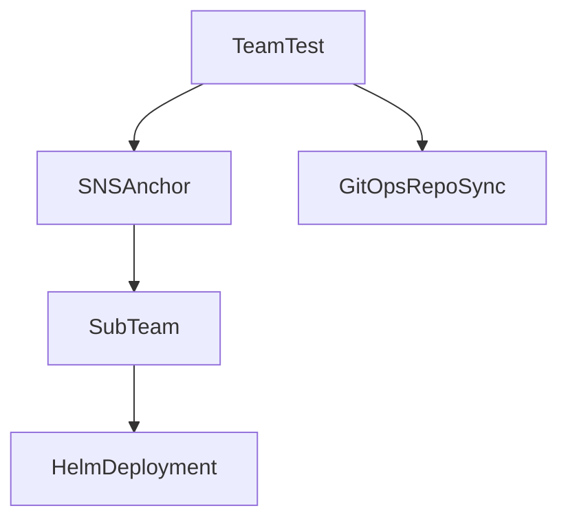

# Multitenant Example

This repository attemps to serve as a guide on handling workloads as a tenant of the MCSH cluster.

Please note the following:

1. Your first namespace assigned. In this example, team-test is the namespace assigned.
2. Your cluster-admin service account. This is a namespace scoped SA that is always rolled into sub namespaces. The name will be the same as your namespace. In this example, team-test is the SA assigned.

In this example repo, the ops folder serves as a gitops referenced used by flux's multitenant system.
An HNC namespace named sub-team is created via the snsanchor definition inside team-test.
Included is this folder is a helm chart that deploys pod-info.



```sh
[sam@sampc multitenant-example]$ kubectl get GitRepository -n team-test
NAME        URL                                                            AGE   READY   STATUS
team-test   ssh://git@github.com/mcserverhosting-net/multitenant-example   38m   True    stored artifact for revision 'main/c1c00408541671d195e59eee67a294d2b672a962'
```

```
kubectl hns tree team-test
team-test
└── [s] sub-team

[s] indicates subnamespaces
```

```sh
[sam@sampc multitenant-example]$ kubectl get helmrelease,pods -n sub-team
NAME                                         AGE   READY   STATUS
helmrelease.helm.toolkit.fluxcd.io/podinfo   52s   True    Release reconciliation succeeded

NAME                           READY   STATUS    RESTARTS   AGE
pod/podinfo-5d4bcccb5c-lqh6x   1/1     Running   0          50s
```

Note, when utilizing HNC, one ***must*** manually create the RoleBindings for subnamespaces to allow flux to control them from a serviceaccount of the parent namespace. The objects can be managed thereafter via gitops.

Note the example:

```sh
flux reconcile kustomization team-test -n team-test
► annotating Kustomization team-test in team-test namespace
✔ Kustomization annotated
◎ waiting for Kustomization reconciliation
✗ Kustomization reconciliation failed: RoleBinding/sub-team/sa-rb dry-run failed, reason: Forbidden, error: rolebindings.rbac.authorization.k8s.io "sa-rb" is forbidden: User "system:serviceaccount:team-test:team-test" cannot patch resource "rolebindings" in API group "rbac.authorization.k8s.io" in the namespace "sub-team"
###
kubectl create -f multitenant-example/ops/namespace/sub-team/rb.yaml
rolebinding.rbac.authorization.k8s.io/sa-rb created
###

flux reconcile kustomization team-test -n team-test
► annotating Kustomization team-test in team-test namespace
✔ Kustomization annotated
◎ waiting for Kustomization reconciliation
✔ applied revision main/5f5ffb490ad00274379e23f990fc45b3f0b854f6
```