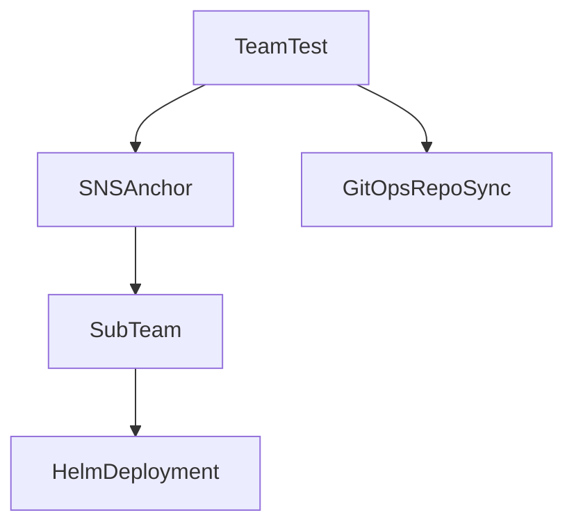

# Multitenant Example

This repository attemps to serve as a guide on handling workloads as a tenant of the MCSH cluster.

Please note the following:

1. Your first namespace assigned. In this example, team-test is the namespace assigned.
2. Your cluster-admin service account. This is a namespace scoped SA that is always rolled into sub namespaces. The name will be the same as your namespace. In this example, team-test is the SA assigned.

In this example repo, the ops folder serves as a gitops referenced used by flux's multitenant system.
An HNC namespace named sub-team is created via the snsanchor definition inside team-test.
Included is this folder is a helm chart that deploys pod-info.

